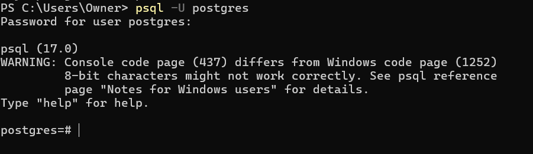
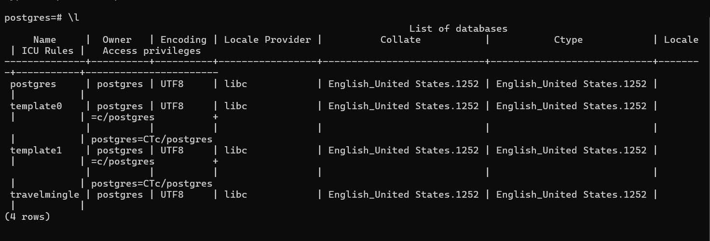

# Jan 30

## How to create an admin user

1. python manage.py shell
2. AUTH_USER_MODEL = 'api.Users'
3. from django.contrib.auth import get_user_model
4. User = get_user_model()
5. User.objects.create_superuser(username='admin', email='admin@example.com', password='123')

# Jan 29 2025

- install [OSGeo4W](https://trac.osgeo.org/osgeo4w/) and select Express install

- add System Variables into `Path`

  ```
  C:\OSGeo4W\bin
  C:\OSGeo4W\apps\gdal\bin
  ```

- create new System variables

  > name: GDAL_DATA
  > value: C:\OSGeo4W\share\gdal
  >
  > name: PROJ_LIB
  > value: C:\OSGeo4W\apps\share\proj

- install related PostgreSQL extension

  > - open Stack Builder app, select current server
  > - under Spatial Extensions, select PostGIS 3.5 Bundle
  > - after agree the license agreement, select all components
  >   

- recreate database

  ```
  DROP DATABASE travelmingle;
  CREATE DATABASE travelmingle;
  \dt
  ```

  if any table returned, drop them all with

  ```
  DROP TABLE auth_group;
  DROP TABLE auth_group_permissions;
  DROP TABLE auth_permission;
  DROP TABLE auth_user;
  DROP TABLE auth_user_groups;
  DROP TABLE auth_user_user_permissions;
  DROP TABLE comments;
  DROP TABLE django_admin_log;
  DROP TABLE django_content_type;
  DROP TABLE django_migrations;
  DROP TABLE django_session;
  DROP TABLE post_images;
  DROP TABLE posts;
  DROP TABLE users;
  ```

  Go to `backend/api/migrations` folder, delete all files `BUT` `_init_.py`. If you don't do this, the command won't work.

  ```
  cd backend
  python manage.py makemigrations
  python manage.py migrate
  ```

- install related packages
  ```
  cd demo
  flutter pub get
  ```

# Nov 24 2024 Recreate the db and load with new data

## Drop `travelmingle` db and re-create a new one

### 1. Log in the db through terminal, and user the command below

```
DROP DATABASE travelmingle;
CREATE DATABASE travelmingle;
\l

```

Use `\l` to check if `travelmingle` is gone.

### 2. Install jwt for authentication

I did this in vscode at project root. I am not using veritual env, so it doesn't matter where I did it.

```
pip install djangorestframework-simplejwt

```

### 3. DB migration

Go to `backend/api/migrations` folder, delete all files `BUT` `_init_.py`. If you don't do this, the command won't work.

```
cd travelmingle/backend
python manage.py makemigrations
python manage.py migrate
python manage.py loaddata users_fixture.json
python manage.py loaddata posts_fixture.json
python manage.py loaddata postImages_fixture.json
python manage.py loaddata comments_fixture.json
python manage.py loaddata likes_fixture.json

```

After this you should have 5 users with psw `123`, please check user name in the json file.

### 4. Run the project

Open two terminals in vscode. Run android emulator.

terminal 1

```
cd backend
python manage.py runserver

```

terminal 2

```
cd demo
flutter clean
flutter pub get
flutter run

```

# End of new update

# How to run the backend with Django

This part assumes you have installed vscode, python 12+, and postgrSQL. This is a check for everyone if the backend is running on your machine.

## 1. pull from main

## 2. How do I check what libraries I need to install

In `root/backend/backend` `settings,py`, you will see this block of code:

```

INSTALLED_APPS = [
'django.contrib.admin',
'django.contrib.auth',
'django.contrib.contenttypes',
'django.contrib.sessions',
'django.contrib.messages',
'django.contrib.staticfiles',
'api',
'rest_framework',
'drf_yasg',
]

```

This is where you should check for `pip install`. Please use AI here to help you to identify what libraried you need to install. For the current code above, we need to run:

```
pip install django-environ
pip install django
pip install djangorestframework
pip install drf-yasg
pip install pillow
pip install psycopg2 or pip install psycopg2-binary
(please ask AI to match this with your own python version)

```

for Python 3.13:

```
pip install django-environ
pip install django
pip install djangorestframework
pip install drf-yasg
pip install pillow
pip install psycopg
pip install --upgrade psycopg[binary]

```

## 3. How to connect with your postgres local database server

We are not using remote host for now due to financial cost issue.
We need to have identical database tables and dummy data on our local machines.

### - Create your own database named `travelmingle`

In your powershell run:

```

psql -U postgres

```

You will be prompted to type password, please type the password you set up earlier when you were instlling postgres. Once you correctly log in your local postgres:



After you see this screen, check what databases you have by typing `\l`, and you will see:


You won't have `travelmingle` on there. Let's create one now:

```

CREATE DATABASE travelmingle;

```

Verify you have created a database called `travelmingle`:

```

\l

```

### Set DB info locally

Create file named `.env` in `root/backend` and add this block of code:

```.env
# Database configuration
DB_NAME=travelmingle
DB_USER=someUser
DB_PASSWORD=somePassword
DB_HOST=localhost
DB_PORT=5432
```

Replace your postgres username, password and port number in the code. Default username is `postgres`. You should see all these three values while setting up your postgres for the first time. Also, you can find those infor by `\conninfo`

### Test

```cmd
cd backend
python manage.py dbshell
```

If the connection is successful, Django will apply the migrations or indicate that everything is up-to-date. If there’s an issue with the credentials, you’ll see an error message.

### - Automate table creations with Django

Go to `backend/api` and find `models.py`.

Django framework enables you to create a models.py file to define your table classes. For example, we have a `posts` table, then we should have a `posts` class in this file. Now that we have defined these tables, we can run a command to create the tables in the database.

```

cd backend/
python manage.py makemigrations
python manage.py migrate

```

Let's verify we have created these tables in travelmingle by running in the terminal we logged in with postgres:

```

\c travelmingle
\dt

```

You should see a long list of tables. Some of them are django default that we can ignore. But make sure you see `posts`, `users`, `post_images`, `comments` tables, which should match your `models.py`.

Many things could go wrong at this step, please take time to check if your python verison is correct, and take the advantage of AI to debug.

### - How to add dummy data to your local database

There are two josn files called `posts_fixture.json` and `users_fixture.json` in the `backend` folder. We will run these command to add these data to the local db:

```

cd backend (you should be at travelmingle/backend )
python manage.py loaddata users_fixture.json
python manage.py loaddata posts_fixture.json

```

Now let's verify the data is added to your local db:
In the db terminal we logged in previously run :

```

\c travelmingle
select _ from users;
select _ from posts;

```

You should see some data in both select queries.

## 4. Finnally let's check if the backend is working

### - where is the database logic code for get,post, put and delete

Go to `travelmingle/api` find `views.py`. This is where all the logic code is at.

### - run the backend and test

```

cd backend (you should be at travelmingle/backend)

python manage.py runserver

```

Go to the url `http://127.0.0.1:8000/swagger/` to check all the current api endpoints. You can also perform the endpoint tests there if you want to.

Or, you can use these url if you are tesing in browser or Postman:
`http://127.0.0.1:8000/api/users/`
`http://127.0.0.1:8000/api/posts/`
`http://127.0.0.1:8000/api/posts/:id`
`http://127.0.0.1:8000/api/users/:id`
...

To see the full lists of endpoint you either check in `travelmingle/backend/api` `urls.py`.
Or, you can check on the swagger page.

## How to change the database tables if needed

If we want to change the table structure, we need to make sure the `models.py` and its corresponding fixture json files are changed. Please inform everyone on the team and make sure the code runs on all of our machines.

```

```
