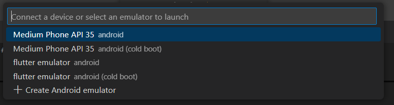
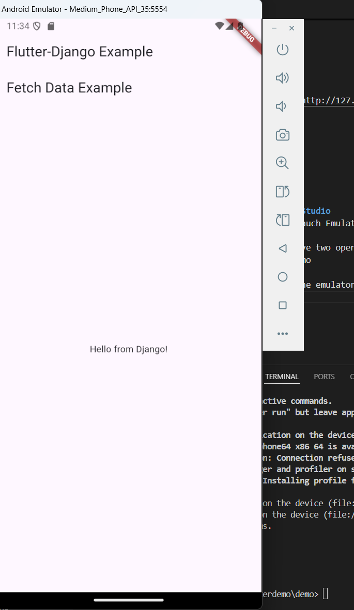
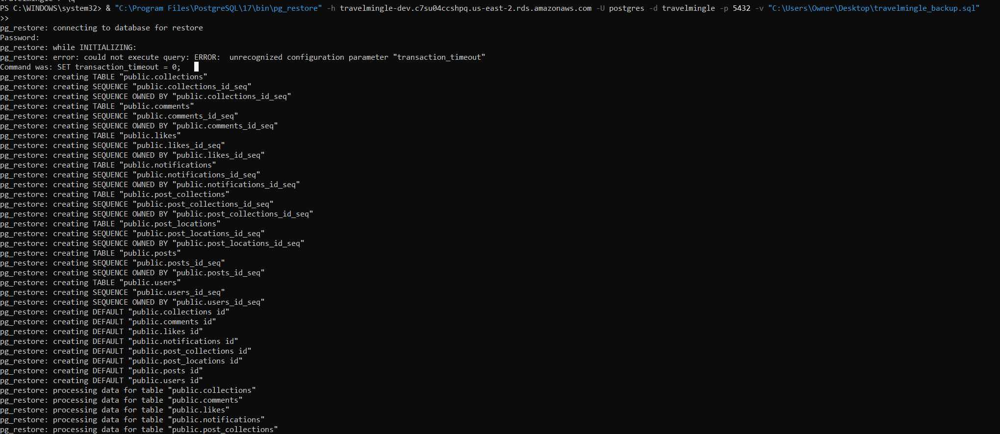

# TravelMingle

## Getting started

To make it easy for you to get started with GitLab, here's a list of recommended next steps.

Already a pro? Just edit this README.md and make it your own. Want to make it easy? [Use the template at the bottom](#editing-this-readme)!

## Installation

### Install Flutter

1. **Download and Extract Flutter SDK**

   - Download the latest Flutter SDK (e.g., version 3.24.4) for Windows from [Flutter’s official website](https://flutter.dev/docs/get-started/install).
   - Extract the zip file to `C:\Users\username\flutter`.

2. **Set Up Environment Path**

   - Go to **Advanced System Settings** > **Environment Variables**.
   - Under "User variables for (username)", click **New**.
     - **Variable Name**: `Path`
     - **Variable Value**: `C:\Users\username\flutter\bin`
   - Click **OK** three times to save.

3. Accept Android Licenses

   - Open **Command Prompt** as Administrator.
   - Run the following command to accept Android SDK licenses:
     `flutter doctor --android-licenses`
   - Type y to accept each license agreement as prompted.
   - (Optional) To disable CLI animations, run:
     `flutter config --no-cli-animations`

4. Verify Installation
   - Run flutter doctor in PowerShell or Command Prompt to check the installation status.
     Note: Ensure both "powershell" and "system32" paths are included in your PATH environment variable.

### Android Studio Setup

1. **Install SDK and API**

   - Open **Android Studio** and navigate to **Tools** > **SDK Manager**.
   - In the **SDK Platforms** tab, select **Android API 35** and click **Apply** to download it.
   - Go to the **SDK Tools** tab and ensure the following are selected:
     - **Android SDK Command-line Tools**
     - **Android SDK Build-Tools**
     - **Android SDK Platform-Tools**
     - **Android Emulator**
   - Click **Apply** and wait for the installation to complete.

2. **Create Virtual Device**
   - Go to **Tools** > **Device Manager**.
   - Click the **+** button to create a new device.
   - Select **Medium Phone** > **Next** > **x86 Images**.
   - Download **API 35 with Google APIs**.
   - In **Advanced Settings**, set **Graphics** to **Hardware** and finish the setup.
   - Click the **Run** icon to start the virtual device.

### Install Postgress

### On Windows

1. Download the PostgreSQL installer from the [official PostgreSQL website](https://www.postgresql.org/download/).
2. Run the installer and select:
   - **Database Server**: PostgreSQL 17.0
   - **Add-ons, Tools, and Utilities**: Include `pgAdmin` and `psql`.
   - **Spatial Extensions**: Optionally include `PostGIS 3.5`.
3. Set a password for the `postgres` user during installation (remember this password).
4. Complete the installation and ensure that the PostgreSQL service is running.

### Common Issues

#### Missing buildscript in android/build.gradle

If you encounter a "missing buildscript" error, add the following to android/build.gradle:

<pre> buildscript {
    repositories {
        google()
        mavenCentral()
    }
    dependencies {
        classpath 'com.android.tools.build:gradle:8.0.2'  // Ensure compatibility with your setup
    }
} </pre>

### Install Python and Django

#### Install Python

1. Go to the official Python download page and download the latest version (Python 3.13).
2. Run the installer. During installation:
3. Check the box that says "Add Python to PATH".
4. Choose "Install Now" for a default installation.
5. Verify the installation by opening Command Prompt and running:
   `python --version`
   This should output the Python version (e.g., Python 3.13).

#### Install Django

1. Install the latest Django version (4.3.1) using pip:
   `pip install django`

2. Verify the installation by running:
   `python -m django --version`

This should output the Django version (e.g., 4.3.1).

### PostgreSQL with Django

1. download PostgreSQL and it's commanline tool.
2. install python library using this command:

```
pip install psycopg2-binary
```

3. In settings.py under `backend`, add password. Now you can run the backend as usual.

## How to run the full-stack project

### Run backend Django server

1. cd backend
2. python manage.py runserver
3. To test it runs on browser: go to http://127.0.0.1:8000/api/hello/, and you should see:

```
{
    "message": "Hello from Django!"
}

```

### Run frontend Flutter and Android Studio

1. ctrl+Shift+P in vscode: "Flutter Lauch Emulator", and choose the default emulator(first one):
   
2. open a new terminal. You should have two open now, one for Django server, one for flutter.
3. In new terminal, cd demo
4. flutter run
5. wait for a while, you should see the emulator like this down below. Make sure you see the "Hello from Django!".

   

## Developer notes:

### 1. url localhost vs. 10.0.2.2

For web develoment, in our case for bakcend testing, we use the standard "localhost" or "127.0.0.1".
However, in Flutter with Android device, the url should be "10.0.2.2", or it won't work.

## Add your files

- [ ] [Create](https://docs.gitlab.com/ee/user/project/repository/web_editor.html#create-a-file) or [upload](https://docs.gitlab.com/ee/user/project/repository/web_editor.html#upload-a-file) files
- [ ] [Add files using the command line](https://docs.gitlab.com/ee/gitlab-basics/add-file.html#add-a-file-using-the-command-line) or push an existing Git repository with the following command:

```
cd existing_repo
git remote add origin https://capstone.cs.utah.edu/travelmingle/travelmingle.git
git branch -M main
git push -uf origin main
```

## Branching Strategy

This section outlines the branching strategy to be used for the TravelMingle social media app project. We'll follow a Git Flow approach, with branches such as `main`, `develop`, `feature`, `bugfix`, and `release`.

---

### Overview of Branches

#### 1. `main`

- The `main` branch is the production branch.
- It contains stable, release-ready code.
- Only `release` branches should be merged into `main`.

#### 2. `development`

- The `develop` branch is where all new features and bug fixes are integrated.
- It serves as the main branch for development before code is released to production.

#### 3. `feature/*`

- `feature` branches are used for developing new features.
- These branches are created from `develop` and merged back into `develop` once the feature is complete and tested.
- Naming convention: `feature/<feature-name>`.
  - Examples:
    - `feature/create-post`
    - `feature/user-authentication`

#### 4. `bugfix/*`

- `bugfix` branches are used for fixing bugs found during development.
- These branches are also created from `develop` and merged back into `develop`.
- Naming convention: `bugfix/<bug-description>`.
  - Examples:
    - `bugfix/fix-comment-section`
    - `bugfix/login-error`

#### 5. `release/*`

- `release` branches are used to prepare for a new production release.
- These branches are created from `develop` and merged into both `main` and `develop` once the release is complete.
- Naming convention: `release/<version-number>`.
  - Example: `release/1.0.0`

---

### Workflow Example

Notice only `development` branch is create from `main`. All the other branches should be from `deployment`.

#### Step 1: Create the `develop` Branch in GitLab UI

1. Go to your **GitLab project**.
2. Click on **Repository** in the left sidebar.
3. Select **Branches**.
4. Click the **"New branch"** button.
5. Enter `develop` as the branch name.
6. Select `main` as the source branch.
7. Click **"Create branch"**.

---

#### Step 2: Create a Feature Branch in GitLab UI

1. Navigate to **Repository** > **Branches**.
2. Click **"New branch"**.
3. Enter the branch name:

## Connect PostgreSQL with AWS RDS(Team, please ignore this section for now)

### 1. Create a back-up file in your local directory

```
& "C:\Program Files\PostgreSQL\17\bin\pg_dump" -U postgres -d travelmingle -F c -b -v -f "C:\Users\Owner\Desktop\travelmingle_backup.sql"
```

### 2. Add this db instance to your aws RDS instance

```
& "C:\Program Files\PostgreSQL\17\bin\pg_restore" -h travelmingle-dev.c7su04ccshpq.us-east-2.rds.amazonaws.com -U postgres -d travelmingle -p 5432 -v "C:\Users\Owner\Desktop\travelmingle_backup.sql"
```

It should look like:


## Integrate with your tools

- [ ] [Set up project integrations](https://capstone.cs.utah.edu/travelmingle/travelmingle/-/settings/integrations)

## Collaborate with your team

- [ ] [Invite team members and collaborators](https://docs.gitlab.com/ee/user/project/members/)
- [ ] [Create a new merge request](https://docs.gitlab.com/ee/user/project/merge_requests/creating_merge_requests.html)
- [ ] [Automatically close issues from merge requests](https://docs.gitlab.com/ee/user/project/issues/managing_issues.html#closing-issues-automatically)
- [ ] [Enable merge request approvals](https://docs.gitlab.com/ee/user/project/merge_requests/approvals/)
- [ ] [Set auto-merge](https://docs.gitlab.com/ee/user/project/merge_requests/merge_when_pipeline_succeeds.html)

## Test and Deploy

Use the built-in continuous integration in GitLab.

- [ ] [Get started with GitLab CI/CD](https://docs.gitlab.com/ee/ci/quick_start/index.html)
- [ ] [Analyze your code for known vulnerabilities with Static Application Security Testing (SAST)](https://docs.gitlab.com/ee/user/application_security/sast/)
- [ ] [Deploy to Kubernetes, Amazon EC2, or Amazon ECS using Auto Deploy](https://docs.gitlab.com/ee/topics/autodevops/requirements.html)
- [ ] [Use pull-based deployments for improved Kubernetes management](https://docs.gitlab.com/ee/user/clusters/agent/)
- [ ] [Set up protected environments](https://docs.gitlab.com/ee/ci/environments/protected_environments.html)

---

# Editing this README

When you're ready to make this README your own, just edit this file and use the handy template below (or feel free to structure it however you want - this is just a starting point!). Thanks to [makeareadme.com](https://www.makeareadme.com/) for this template.

## Suggestions for a good README

Every project is different, so consider which of these sections apply to yours. The sections used in the template are suggestions for most open source projects. Also keep in mind that while a README can be too long and detailed, too long is better than too short. If you think your README is too long, consider utilizing another form of documentation rather than cutting out information.

## Name

Choose a self-explaining name for your project.

## Description

Let people know what your project can do specifically. Provide context and add a link to any reference visitors might be unfamiliar with. A list of Features or a Background subsection can also be added here. If there are alternatives to your project, this is a good place to list differentiating factors.

## Badges

On some READMEs, you may see small images that convey metadata, such as whether or not all the tests are passing for the project. You can use Shields to add some to your README. Many services also have instructions for adding a badge.

## Visuals

Depending on what you are making, it can be a good idea to include screenshots or even a video (you'll frequently see GIFs rather than actual videos). Tools like ttygif can help, but check out Asciinema for a more sophisticated method.

## Usage

Use examples liberally, and show the expected output if you can. It's helpful to have inline the smallest example of usage that you can demonstrate, while providing links to more sophisticated examples if they are too long to reasonably include in the README.

## Support

Tell people where they can go to for help. It can be any combination of an issue tracker, a chat room, an email address, etc.

## Roadmap

If you have ideas for releases in the future, it is a good idea to list them in the README.

## Contributing

State if you are open to contributions and what your requirements are for accepting them.

For people who want to make changes to your project, it's helpful to have some documentation on how to get started. Perhaps there is a script that they should run or some environment variables that they need to set. Make these steps explicit. These instructions could also be useful to your future self.

You can also document commands to lint the code or run tests. These steps help to ensure high code quality and reduce the likelihood that the changes inadvertently break something. Having instructions for running tests is especially helpful if it requires external setup, such as starting a Selenium server for testing in a browser.

## Authors and acknowledgment

Show your appreciation to those who have contributed to the project.

## License

For open source projects, say how it is licensed.

## Project status

If you have run out of energy or time for your project, put a note at the top of the README saying that development has slowed down or stopped completely. Someone may choose to fork your project or volunteer to step in as a maintainer or owner, allowing your project to keep going. You can also make an explicit request for maintainers.
